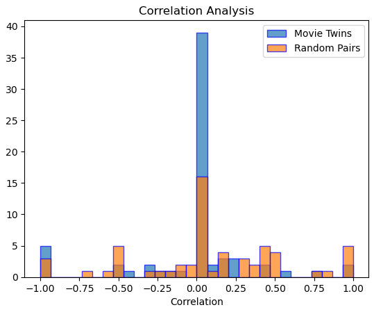
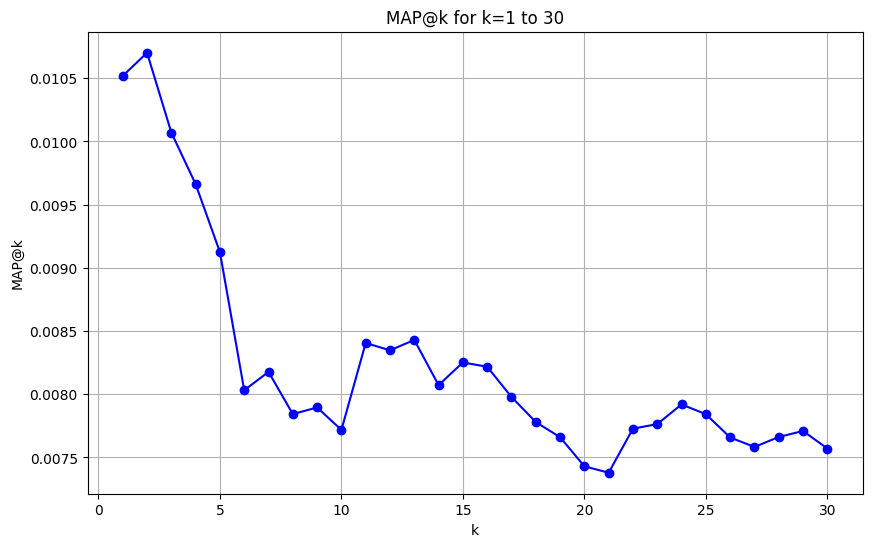

### Big Data: Capstone Project

#### Recommender System for Movie Ratings

#### Team Members: Yan Konichshev, Ziyue (Tom) Zhou

---

### Link to our repo:

https://github.com/nyu-big-data/capstone-project-cap21/

---

### List of the most similar pairs of users based on their movie watching style:

To find the most similar pairs of users based on their movie watching style, we load user ratings data from an HDFS location, processes the data to retain only user IDs and the movies they have rated, and then uses `CountVectorizer` to convert these lists into binary vectors. These vectors are then input into a MinHashLSH algorithm to find similar users based on Jaccard similarity. We then filters and ranks these pairs, displaying and saving the top 100 similar pairs to a CSV file, and using MinHashLSH instead of the real jaccard similarity or Minhash efficiently handles large volumes of data, making it suitable for datasets typically used in a big data environment.

```bash
+---------+---------+-----------------------+
| userIdA | userIdB | JaccardDistance       |
+---------+---------+-----------------------+
| 130     | 145     | 0.30000000000000004   |
| 130     | 574     | 0.30000000000000004   |
| 130     | 468     | 0.3055555555555556    |
| 126     | 379     | 0.31818181818181823   |
| 242     | 468     | 0.3414634146341463    |
| 126     | 130     | 0.3902439024390244    |
| 150     | 270     | 0.3902439024390244    |
| 94      | 347     | 0.39682539682539686   |
| 81      | 126     | 0.4                   |
| 46      | 468     | 0.4042553191489362    |
| 130     | 485     | 0.40625               |
| 126     | 498     | 0.4130434782608695    |
| 145     | 574     | 0.4137931034482759    |
| 130     | 242     | 0.42500000000000004   |
| 270     | 389     | 0.42553191489361700   |
| 126     | 340     | 0.4285714285714290    |
+---------+---------+-----------------------+
```

To see the source code, please check `./src/movie_twins.py`
To see the full list, please check `./src/top_100_ml-latest.csv`

---

### A comparison between the average pairwise correlations between these highly similar pair and randomly picked pairs:

To evaluate how similar the "movie twins" are, we performed a statistical analysis to compare the ratings correlation between pairs of users defined as "movie twins" and random user pairs, using movie rating data. The core analysis calculates the Pearson correlation coefficient between the ratings from each user in the pair for movies they've both rated. This process is repeated for both "movie twins" and randomly generated user pairs for comparison. The results are then statistically compared using a t-test to determine if the correlation among "movie twins" is significantly higher than that of random pairs. Finally, the correlation distributions are visualized using histograms, and a p-value is calculated to assess the statistical significance of the results.

Movie Twins:

```bash
+--------+--------+-------------+
| userId1| userId2| correlation |
+--------+--------+-------------+
|      94|       8|     0.000000|
|      94|      56|     0.000000|
|      94|      81|     0.550848|
|     126|      81|     0.000000|
|     126|      94|    -1.000000|
+--------+--------+-------------+
```

Random Pairs:

```bash
+--------+--------+-------------+
| userId1| userId2| correlation|
+--------+--------+-------------+
|       2|     403|    0.306013|
|      21|     597|    0.990867|
|      33|     141|    0.408248|
|      51|     321|    0.438529|
|      52|     374|   -1.000000|
+--------+--------+-------------+
```

To see the source code and the full list, please check `./src/validation_final.ipynb`

<figure>
  
  <figcaption>Correlation Analysis</figcaption>
</figure>

---

### Documentation of how the train/validation splits were generated + pre-processing overview:

It was an essential part of the assignment as we had to make sure there are no leaks between the train and validation sets. In `data_partition_full.py` script, we processed and split movie ratings data into training, validation, and test sets. Initially, we read multiple CSV files (ratings, tags, movies, genome scores, and genome tags) into Spark DataFrames, cleaned them by removing rows with missing values and duplicates, and then prepared the movie data by adding relevant tags and computed features. The genres of each movie were split and transformed into numerical features using a `CountVectorizer`. We also ranked the ratings by user and timestamp, and calculated the total number of ratings per user.

To create the splits, we assigned each user's ratings to training, validation, and test sets based on their chronological order, with the first 60% of ratings going to the training set, the next 20% to the validation set, and the remaining 20% to the test set. These splits ensure that the temporal nature of the data is respected. We then joined the enriched ratings data with tags and movies to create final datasets, ensuring no duplicates. We saved these datasets into separate CSV files for training, validation, and testing purposes. This method maintains the integrity of the data and prepared it for subsequent analysis and model training.

Here is how the data looked like after it was split:

```bash
+------+-------+------+--------------------+
|userId|movieId|rating|                 tag|
+------+-------+------+--------------------+
|    14|  58559|   5.0|            violence|
|    26|    296|   4.5|   quentin tarantino|
|    37|    593|   4.5|     Anthony Hopkins|
|    37|   1127|   4.5|       James Cameron|
|    37|   1653|   4.5|            dystopia|
|    37|   8961|   4.0|               Pixar|
|    37|  58559|   5.0|        Heath Ledger|
|   302|   5995|   5.0|        World War II|
|   302|  69481|   5.0|                 war|
|   370|   1084|   2.5|   movie of its time|
|   370|   4190|   2.5|better not see bu...|
|   411|    593|   5.0|psycholgical thri...|
|   418|   3000|   5.0|       Studio Ghibli|
|   429|   1721|   4.5|                 sex|
|   499|     34|   0.5|villain nonexiste...|
|   499|    808|   3.5|          wilderness|
|   499|   2096|   3.0|  visually appealing|
|   499|   2294|   4.0|         Woody Allen|
|   499|   3000|   4.5|             surreal|
|   499|   8640|   2.5|        Roman empire|
+------+-------+------+--------------------+
```

We made sure to partition by users, so we would be able to estimate the performance of the models we were building in the next tasks appropriately.

---

### Evaluation of the popularity baseline model:

We used the popularity based model, where we simply aggregated the movies based on the number of ratings they received (we decided to set a threshold of 100 ratings per movie, so we really get the popular movies only) and averaged them. We then sorted the movies in descending order of the number of the average rating and recommended the top 30 movies to all the users. This model is simple and easy to implement, but it does not take into account the user's preferences or the quality of the movies. It is a good starting baseline model to compare the performance with more sophisticated models. The most "popular" movies recommended to the users, which received the most number of good reviews are stored in the `popular_movies.csv` file. Here is the snapshot of how it looks like:

```bash
+-------+------------------+------------+
|movieId|    average_rating|count_rating|
+-------+------------------+------------+
| 202439| 4.579908675799087|         219|
|    318| 4.576023391812866|        1026|
|   2959|4.5375302663438255|         826|
|   5618| 4.519230769230769|         390|
|   1203|4.5139664804469275|         179|
|   2019|  4.47196261682243|         107|
|   4973| 4.471563981042654|         422|
|  44555| 4.465217391304348|         115|
|   7361| 4.453757225433526|         519|
| 104374| 4.452991452991453|         117|
+-------+------------------+------------+
```

We are using the mean average precision (MAP) as the evaluation metric for the popularity baseline model. The MAP is calculated by taking the average of the precision at each relevant item in the list of recommendations. The precision is the number of relevant items recommended divided by the total number of recommendations. The MAP is a good metric to evaluate the performance of the popularity baseline model as it considers the order of the recommendations and the relevance of the items. We did set a threshold of 3 for the "good" movies, and then used it for the evaluation of the model. For our use-case, we wanted to know what would be the optimal number of the most popular movies we should push to the users, thus we calculated the MAP for the top 30 movies recommended to the users with MAP@1-30. This way, we made sure that we try out all the different values for the number of recommendations and see which one performs the best. The best MAP value we got was 0.01247960065277911 for top 2 recommended movies to the users (refer to `evaluate_popularity_model.py` for more). This means that the popularity baseline model is not very effective in recommending movies to the users, as the MAP value is very low. Here is the graph of how different @ values affect the MAP@k score, we tuned that "hyperparameter" to get the best performance on the validation set and then got the final MAP@k score on the test set:

```bash
MAP@1: 0.010518590998043052
MAP@2: 0.010702054794520547
MAP@3: 0.010070123939986944
MAP@4: 0.009662426614481408
MAP@5: 0.00912426614481415
MAP@6: 0.008031637312459195
MAP@7: 0.008177243500139837
MAP@8: 0.007843077299412917
MAP@9: 0.00789573820395746
MAP@10: 0.007717710371820028
MAP@11: 0.008405977584059865
MAP@12: 0.008347602739726064
MAP@13: 0.008429926238145551
MAP@14: 0.00807240704500974
MAP@15: 0.008251793868232332
MAP@16: 0.008217649217221136
MAP@17: 0.007978876482099835
MAP@18: 0.007780223961730935
MAP@19: 0.0076604181687095615
MAP@20: 0.00743028375733846
MAP@21: 0.007379321591650507
MAP@22: 0.007727717487991572
MAP@23: 0.0077639751552794
MAP@24: 0.007919520547945123
MAP@25: 0.007842465753424533
MAP@26: 0.0076584374529581655
MAP@27: 0.007583170254403236
MAP@28: 0.007661797595750522
MAP@29: 0.007709697010594623
MAP@30: 0.007570939334637942
Best k: 2
MAP@2 on test dataset: 0.01247960065277911
```

<figure>
  
  <figcaption>Map at K graph</figcaption>
</figure>

---

### Documentation of latent factor model's hyper-parameters and validation

We configures an ALS (Alternating Least Squares) model specifically targeting the recommendation system's needs by setting `userCol`, `itemCol`, and `ratingCol` parameters to link the relevant data fields. To manage the inherent issue of cold starts in recommendation systems, where new users or items have insufficient interactions to make reliable predictions, the model employs a "drop" strategy to exclude such cases from the dataset. Additionally, a `ParamGridBuilder` is used to explore various model configurations, defining a grid over the model's rank and `regularization parameter (regParam)`. This grid helps in tuning the model by testing different combinations of these parameters to find the optimal setting that minimizes prediction errors, enhancing the model's accuracy and effectiveness.

Model training is executed through a `CrossValidator`, which integrates the ALS model with the specified parameter grid and a regression evaluator using RMSE as the evaluation metric. The cross-validation process divides the training data into three folds, iteratively training on two folds and validating on the third to ensure the model's robustness and generalizability. After training, the best model is determined based on the lowest RMSE score across validation folds. This model is then employed to predict ratings on both validation and test datasets. The resulting RMSE values for these datasets are calculated and reported, providing a clear measure of the model's prediction accuracy on unseen data. These metrics are crucial for assessing the model's practical performance and guiding further refinement.

```bash
Root Mean Square Error (RMSE) on validation data: 1.0310553273577203
Root Mean Square Error (RMSE) on test data: 1.0914484926854
```
---

### Evaluation of latent factor model

To evaluate the performance of the model, RMSE might not be the best metric, so we user MAP@K as a better metric. The best model is loaded and then used to generate top 30 recommendations for all users `(recommendForAllUsers(30))`, which produces a list of movies likely to be of interest to each user. These recommendations are cross-referenced with actual interactions in the test set, which has been aggregated by user to list all movies rated by them. The predictions and actual ratings are joined on the user ID to combine model output and true data for each user into a single DataFrame. This DataFrame is then transformed to align with the format required by Spark's RankingMetrics, which evaluates ranking models. Each user's recommended movie IDs and the list of movies they've actually interacted with are converted into an RDD (Resilient Distributed Dataset) for efficient distributed processing. The evaluation metrics calculated are the precision at k (precisionAt(k)) for k ranging from 1 to 30. This metric measures the proportion of recommended items in the top-k set that are relevant, providing insight into the effectiveness of the model at various levels of recommendation depth.

```bash
MAP@1: 0.00014630577907827363
MAP@2: 0.00014630577907827352
MAP@3: 0.00024384296513045616
MAP@4: 0.00032918800292611563
MAP@5: 0.00040965618141916604
MAP@6: 0.0004633016337478666
MAP@7: 0.0005852231163130947
MAP@8: 0.000658376005852231
MAP@9: 0.000715272697716004
MAP@10: 0.0007022677395757133
MAP@11: 0.0007714304715036247
MAP@12: 0.0007681053401609367
MAP@13: 0.0007990546395813404
MAP@14: 0.0008255826105131159
MAP@15: 0.0009070958302852965
MAP@16: 0.0009601316752011704
MAP@17: 0.0009466844528594175
MAP@18: 0.0009753718605218238
MAP@19: 0.0009548377160897853
MAP@20: 0.001016825164594002
MAP@21: 0.001086842930295747
MAP@22: 0.0010972933430870523
MAP@23: 0.0010750294201838362
MAP@24: 0.001139965861984882
MAP@25: 0.0011704462326261886
MAP@26: 0.0011817005233245176
MAP@27: 0.0011812836977430977
MAP@28: 0.0012331487093740208
MAP@29: 0.0012410766087329415
MAP@30: 0.0012387222628627162
Best k: 29
MAP@2 on test dataset: 0.0012410766087329415
```

In terms of the performance, the latent factor model is not as good as the popularity model. The reason for this is that both the training ratings matrix and the test ratings matrix is highly sparse and rank = 50 is not enough for such a huge movie ratings dataset. However, we can see an obvious trend of increase as K increases from the latent factor model but not from the popularity based model. This might suggest that some hidden information about each user's preference is captured by the model through training.
